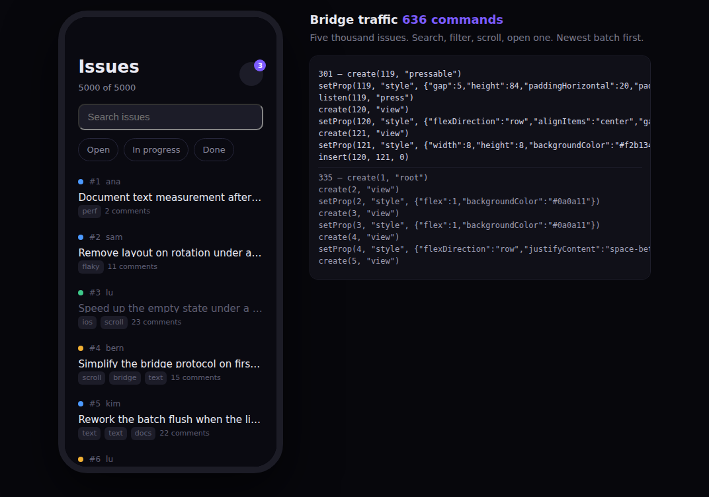
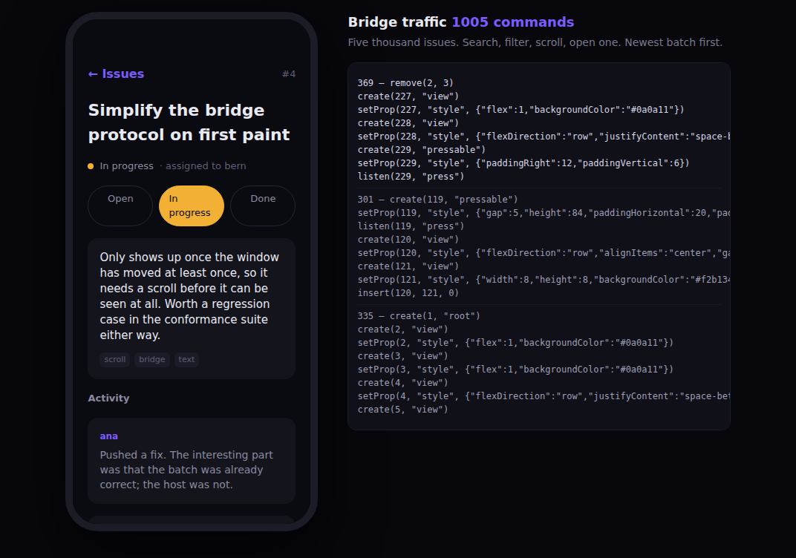

# The tracker

An issue tracker over five thousand issues: a live search, three filters, a
windowed list, a second screen, and a status control that writes one signal.

```sh
npm run native:preview     # http://localhost:3100/tracker.html
npm run native:measure     # the table below, from a headless host
npm run native:ios:build   # bundle it for the iOS host — see ../../ios/README.md
```

The tracker is what `npm run native:ios:build` bundles by default; `XOTE_APP=counter`
picks the smaller example instead.





## Why it exists

`ROADMAP.md` ends on a measurement: the premise of the whole architecture is
that fine-grained reactivity makes the bridge cheap — no diff, so a change costs
the mutations it implies and nothing else — and the only evidence for that was a
counter. This is the same measurements against a screen at real-app scale.

`native/test/tracker_test.mjs` runs it against a headless host and prints:

```
  5000 issues, a 720pt viewport

                                     commands   views
  mount the whole screen                  335     118
  ...then learn the viewport              459     283
  type a query matching many              336     283
  type a query matching few               931     265
  type a query matching nothing           269      31
  clear the query                         265     118
  toggle a filter chip                    884     271
  clear the filter                        904     283
  scroll within one row                     0     283
  scroll across one row                    75     289
  scroll to the middle of the list       1000     289
  scroll back to the top                  984     283
  open an issue                           423      53
  change an issue's status                  8      53
  go back                                 383     118
```

**The premise holds.** Every number tracks what changed *on screen*; none of
them tracks the dataset. Five thousand issues never cost five thousand of
anything — the screen holds under 300 views, and the largest single operation is
a screenful.

Three rows are worth reading closely:

- **`change an issue's status`: 8 commands.** Pressing a status button writes
  one signal that belongs to that issue. Three buttons restyle themselves, the
  status dot changes colour, the label changes text — and nothing is created,
  destroyed or reconciled. That is the whole argument in one gesture.
- **`scroll within one row`: 0 commands.** A drag produces a scroll event every
  frame; the visible range changes a few times a second. Holding the range in a
  signal with a structural comparison means the frames in between cost nothing
  at all, because `Signal.set` does not notify when the value is unchanged.
- **`toggle a filter chip`: 884 commands.** This is the honest one. Changing a
  filter changes *which issues are visible*, so a screenful of rows really is
  rebuilt — about eleven nodes each. It is proportional to the screen, not to
  the 5,000 issues behind it, which is the claim; it is not free, which no
  claim was ever made about.

## What it exercises

| | |
|---|---|
| `TrackerData.res` | Five thousand issues, generated deterministically. Per-issue state lives in its own signal. |
| `TrackerTheme.res` | The palette and the shapes that repeat. Styles are values; a variation is a merge. |
| `TrackerNav.res` | A stack of screens in a signal. **Not** native navigation — see below. |
| `TrackerIssues.res` | Search, filters, the windowed list, the empty state, an absolutely positioned badge. |
| `TrackerDetail.res` | Wrapping text the host measures, a scroll view, the status control. |
| `TrackerApp.res` | One `View.tracked` over the navigation stack. |

## Two things this got wrong first, which are worth knowing

**A component that creates state must be a component.** `TrackerIssues` was
first written as a plain function called from inside the navigation's `tracked`
block. Its `Signal.make` and `Effect.run` therefore ran *inside* that block, so
the effect's reads became the block's dependencies — and every keystroke
re-rendered the whole screen and reset the search field. Giving it a props
record makes `NativeJSX.jsx` wrap it in `View.LazyComponent`, whose body runs
untracked in its own scope, and the problem disappears.

`NativeList` had the same bug and now protects itself the same way: its body is
a `LazyComponent`, so building a list inside a reactive region is safe. Without
that, the list reported its layout, the region rebuilt the list, the new list
reported its layout, and the two drove each other in a loop — 174,782 commands
before it was caught, against 335 now.

**`int` multiplication is `Math.imul`.** The dataset generator was a Lehmer
RNG in integers, which wrapped to 32 bits, went negative, and produced
`undefined` for every generated field. It is a float now. Nothing about this is
specific to Xote, and it will bite anyone doing arithmetic in ReScript that
leaves the 32-bit range.

## What it is not

Navigation here is a stack of screens in a signal and the top one renders.
There are no platform transitions, no interactive back gesture, and no
per-screen lifecycle. Those need a host that owns a real navigation controller,
which is the open item in [`../../ROADMAP.md`](../../ROADMAP.md). A screen change
is also the one place on this app where re-rendering wholesale is exactly right,
which is why the seam sits there.
