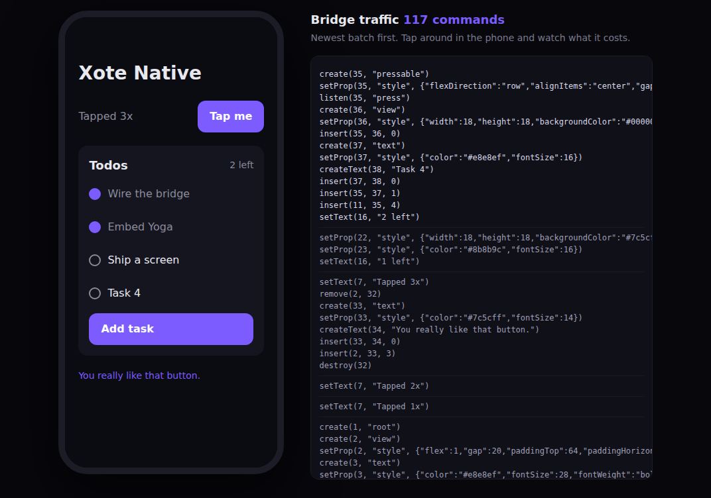
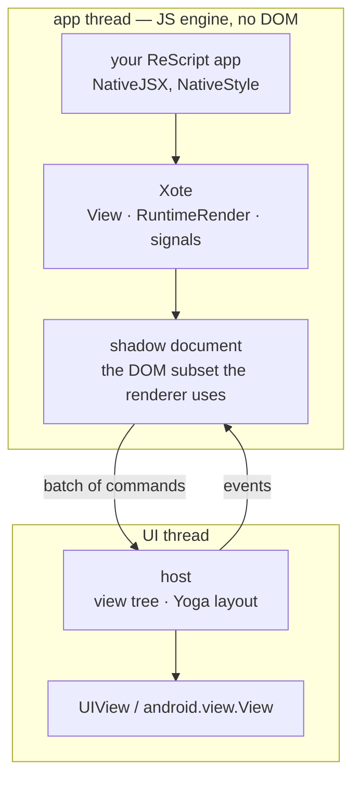

# Xote Native — an exploration

> **Status: prototype.** Everything here runs and the tests are real, but
> nothing is published and nothing is API-stable. There is an iOS host in
> [`hosts/ios/`](./hosts/ios/) that has run a real screen on a simulator, and an
> Android host in [`hosts/android/`](./hosts/android/) that has never been
> compiled. It exists to answer one question — *what would it actually take to
> render Xote to native views?* — with running code rather than a proposal.
>
> **The findings are written up in [`REPORT.md`](./REPORT.md)**: how this
> package is built on Xote's primitives, how it is packaged separately from the
> web library, what `xote` had to change, and an assessment of the demo — the
> good, the bad, the gaps and the limitations.

## Two packages, one repository

`xote-native` is **its own ReScript and npm package**, not a directory of
`xote`. It has its own `rescript.json` — namespace `XoteNative`, `xote` as a
dependency, `-open Xote` so its modules can say `View` rather than `Xote.View` —
and its own `package.json`, `exports` map and tests. `npm run res:build` for
`xote` does not compile it.

The two sit side by side under `packages/`, and the repository root is an npm
workspaces root: `npm install` there links `node_modules/xote` at
`packages/xote`, which is how this package resolves it — **by package name,
exactly as a downstream consumer would**. There is no special arrangement to
know about.

Run it, from either the repository root or here:

```sh
npm run native:test         # or, in this directory: npm test
npm run native:preview      # open http://localhost:3100/preview.html
npm run native:bundle:test  # the shipped bundle, in a realm with no DOM
```

`test/package_test.mjs` is the one worth knowing about: it stages both
packages into a temporary `node_modules` exactly as `npm install` would lay them
out and compiles an app against them, so what is checked is what would ship
rather than what happens to work through a symlink.

To run it on a device, see [`hosts/ios/README.md`](./hosts/ios/README.md) or
[`hosts/android/README.md`](./hosts/android/README.md).



That is a ReScript app, compiled by the same Xote renderer a web app uses,
rendering through a command protocol into views it has never heard of. The
panel on the right is everything that crossed the bridge.

---

## The short version

React Native's architecture is shaped by React's: React re-renders component
subtrees and diffs the result, so something has to own that diff, batch it, and
ship it to the UI thread. The reconciler is not an implementation detail there —
it is the reason the bridge exists in the form it does.

Xote does not have that problem. A `Signal.set` runs its dependents
synchronously, and each dependent performs exactly the mutation its own value
implies: one text node's contents, one attribute, one keyed row's position.
There is no tree to diff because there is no re-render. **A renderer built on
fine-grained reactivity emits the native mutation stream directly.**

So a native Xote is not "Xote plus a reconciler". It is Xote plus a definition
of what a mutation *is* when the target is a `UIView` instead of a DOM node.
That turns out to be eight commands.

In the example screen: mounting is 91 commands for 32 views, tapping the counter
is **1** command, toggling a row is **3**, and adding a row is **13** — the new
row and nothing else. Those are not optimizations, they are what the reactivity
graph already computed.

---

## How it works



### 1. The renderer needs less of a DOM than you would think

`RuntimeRender` and `RuntimeDom` between them touch about two dozen DOM
operations, and that is the whole coupling:

| Kind | What the renderer uses |
|---|---|
| Create | `createElement`, `createElementNS`, `createTextNode`, `createComment`, `createDocumentFragment`, `getElementById` |
| Tree | `appendChild`, `insertBefore`, `removeChild` / `remove` |
| Walk | `parentNode`, `firstChild`, `nextSibling`, `childNodes`, `nodeType` |
| Write | `setAttribute`, `removeAttribute`, `textContent`, `innerHTML = ""`, `value`, `checked`, `disabled` |
| Events | `addEventListener` |

`host/shadow.mjs` implements exactly that list over a plain JavaScript tree and
turns every mutation into a command. The renderer is untouched and does not know
it is being watched — which is the point: this prototype required **no changes
to `src/`**.

### 2. Eight commands (`host/protocol.mjs`)

```
create(id, type)              createText(id, text)
setProp(id, key, value)       setText(id, text)
insert(parentId, id, index)   remove(parentId, id)
destroy(id)                   listen(id, event)
```

Ids are integers. Values are whatever structured-cloneable thing the app passed —
a style object crosses as an object, not as a parsed string. Events come back as
`(id, name, payload)`.

`remove` and `destroy` are deliberately separate. The keyed reconciler moves a
row by detaching and re-inserting it in the same pass; a host that destroyed on
detach would throw away the view in between. `destroy` is emitted at flush time
for whatever is still parentless, so a move costs nothing.

### 3. Two trees, not one

A host keeps a layout node for every node the app made, and a view only for the
ones that need one. Most boxes on a screen exist to arrange their children — a
column with a gap, a row with padding, a wrapper carrying `flex: 1` — and they
have to be in the first tree because they do arrange things, and do not have to
be in the second because they draw nothing. `host/flatten.mjs` is the policy;
the children of a flattened box attach to the nearest ancestor that has a view,
offset by where it ended up.

Frames come from the layout tree, so flattening cannot move anything. That is
the property worth stating as a rule rather than a hope: the conformance suite
compares the frames and the view tree *separately*, and `test/flatten_test.mjs`
replays one command stream into a flattening host and a non-flattening one and
asserts the frames come out identical.

Views are also pooled (`host/pool.mjs`): `destroy` gives one back, `create`
takes one out. The protocol already guarantees a destroyed id is never
referenced again, which is exactly the guarantee a pool needs.

Neither is available to the DOM preview host, and that is not an oversight —
CSS has no way to express a box with no element, so both are only open to a host
whose layout tree and view tree are separate objects.

### 4. Two node kinds never reach the host

- **Comments.** The keyed-list reconciler brackets its rows with comment
  anchors. They exist only in the shadow tree.
- **Transparent elements.** Every reactive region renders its children into a
  `<div style="display: contents">` — a grouping box the web erases at layout
  time. Native layout has no equivalent, and a stray box in a flex column is a
  visible bug, so the projection flattens it: a transparent node's children are
  spliced into its nearest rendered ancestor.

Flattening is why `insert` carries an index instead of a "before" sibling. The
shadow position and the native position are different numbers, and only the
shadow document knows both. The test asserts that no `div` and no comment ever
reaches the host.

### 5. Threading

The app thread needs a JavaScript engine and no DOM; the UI thread needs views.
On a device that is Hermes or JavaScriptCore next to UIKit. In the preview it is
a **Web Worker** next to the browser's DOM — not a trick to get around anything,
but the same architecture at a smaller scale, and a useful forcing function: a
worker cannot cheat by reaching for the real document, so anything that works
there works on a device.

(A realm that already has a DOM is the one place the shadow document cannot
simply be installed — `Window.document` is unforgeable, so assigning the global
does not take. There are two ways round it and both are in here: run the app in
a worker, which has no DOM at all, or evaluate the bundle inside a scope that
*shadows* `document` and hand `install()` an `xoteBindDocument` to write to
that binding. The preview takes the first, the Android host's `WebView` engine
the second, and `install()` refuses loudly when it is given neither.)

---

## What is in here

| Path | What it is |
|---|---|
| `host/protocol.mjs` | The eight opcodes. The entire contract. |
| `host/shadow.mjs` | The DOM subset, and the projection onto commands. |
| `host/runtime.mjs` | Installs the shadow document, batches, flushes. |
| `host/headless.mjs` | Reference host, ~80 lines. The executable spec. |
| `host/layout.mjs` | Flexbox, checked frame-for-frame against Chromium. |
| `host/flatten.mjs` | Which nodes need a view of their own, and which are only arranging things. |
| `host/pool.mjs` | The view pool a `destroy` returns to and a `create` takes from. |
| `host/capabilities.mjs` | What the hosts implement — the list the ReScript types are checked against. |
| `host/reference.mjs` | The protocol *and* layout, with nothing to draw on — the executable spec. |
| `host/preview.mjs` | Second host: real DOM and flexbox, for looking at things. |
| `conformance/` | Cases every host must satisfy: a batch in, a node tree, frames, text and a view tree out. |
| `host/capabilities.mjs` | What the hosts implement — the list the ReScript types are checked against. |
| `NativeStyle.res` | Typed flexbox styles. Points, percentages, `auto`. Every field is one some host reads — see below. |
| `NativeJSX.res` | The JSX module: `<view>`, `<text>`, `<image>`, `<scroll>`, `<input>`, `<pressable>`. |
| `NativeProp.res` | Untyped JSX values into `View.attrValue`, without stringifying. |
| `Native.res` | The same primitives without JSX. |
| `NativeList.res` | A list that renders a window rather than a dataset. |
| `NativeApp.res` | `mount`. |
| `example/CounterApp.res` | A screen: counter, keyed list, conditional region. |
| `example/PanelApp.res` | The same primitives without JSX. |
| `example/tracker/` | An issue tracker over 5,000 issues — the example that measures the premise. |
| `test/Native_test.mjs` | End-to-end, asserting *how much* crosses the bridge. |
| `test/surface_test.mjs` | The types may not promise more than the hosts deliver. |
| `test/protocol_test.mjs` | The handshake between a bundle and a host that ship separately. |
| `test/package_test.mjs` | `xote-native` compiled and consumed as its own package. |
| `bundle/` | The app-thread entry point and the bundler. One bundle, every platform. |
| `hosts/ios/` | JavaScriptCore + UIKit. See `hosts/ios/README.md`. |
| `hosts/android/` | A JavaScript engine + `android.view`. See `hosts/android/README.md`. |

**The types do not over-promise, and that is enforced.** `NativeStyle` and
`NativeJSX` declare only what a native host actually reads, because a prop that
type-checks and then does nothing is worse than a missing one — a missing one is
a compile error and a five-minute answer, and a silent one is an afternoon.
`host/capabilities.mjs` is the list, and `test/surface_test.mjs` reads the
ReScript sources, the layout engine and the Swift host as text and asserts the
three agree. It is also the only check this repository can run against the Swift
at all, since there is no toolchain here.

So `flexWrap`, `alignContent` and baseline alignment are absent: they are the
three things the layout engine does not do, and reaching for one is now a
compile error rather than a silently ignored property — which is exactly the
point at which the engine should be swapped for Yoga. `lineHeight`,
`letterSpacing`, `fontStyle` and `textTransform` are absent because they change
how big a string is, so they need the measure callback to change with them.
Anything not named can still be passed through `attrs` to a host that knows
about it.

A native screen looks like this — note that `@@jsxConfig` switches JSX modules
per file, so native screens and web pages can live in one project:

```rescript
@@jsxConfig({version: 4, module_: "NativeJSX"})

module Style = NativeStyle

<view style={Style.make({flex: 1.0, padding: Style.pt(20.0), gap: 12.0})}>
  <text style={Style.make({color: "#e8e8ef", fontSize: 28.0, fontWeight: #bold})}>
    {View.text("Xote Native")}
  </text>
  <pressable onPress={_ => Signal.update(count, c => c + 1)}>
    <text> {View.signalText(() => Int.toString(Signal.get(count)))} </text>
  </pressable>
</view>
```

---

## What the core would have to change

> **Since written: three of these four have landed** — 105 insertions across six
> files in `src/`. `Opaque`/`OpaqueSignal`/`OpaqueCompute` are real constructors
> on `View.attrValue`, and `document.createXoteGroup()` /
> `document.createXoteElement(tag)` are the two host hooks. The fourth is
> upstream in `rescript-signals` and is pinned by a test rather than worked
> around. [`REPORT.md` §6](./REPORT.md) is the current state; the four
> statements below are kept because they are the reasoning that produced them.

The prototype was built deliberately changing nothing in `src/`, which meant it
worked around four things instead. Each is a small, real change worth making if
this becomes a supported target.

**1. `attrValue` should carry an opaque payload.** Native props are objects,
numbers and booleans; `View.attrValue` declares `string`. At runtime the
renderer never inspects the value — it hands it to `setAttrOrProp` — so
`NativeProp` casts and the value survives. That works, and it is exactly the
kind of thing `AGENTS.md` warns `Obj.magic` is for, but a variant that carries
an unknown payload would make the cast unnecessary and would also let the web
renderer pass an object to a custom element, which it cannot do today.

**2. A reactive region needs a host-neutral grouping node.** `SignalFragment`
hard-codes `<div style="display: contents">`. The shadow document recognises the
`div` and erases it, which is a heuristic sitting on an implementation detail. A
`Group` node the renderer creates through the host — a real element on the web,
nothing at all on native — would remove both the heuristic and the flattening
walk.

**3. The SVG tag table belongs to the DOM host.** `RuntimeDom.isSvgTag` routes
`text`, `image`, `line`, `mask`, `filter`, `use` and a dozen others through
`createElementNS`. Half of those are perfectly ordinary native view names. The
shadow document ignores the namespace, which is fine, but the table is a web
assumption living in shared code.

**4. Dirty-flag over-propagation costs more here.** A computed with `~equals`
stops the *notification* when its value is unchanged, but the dirty flag has
already propagated, so an intermediate computed downstream still recomputes and
still notifies. On the web that re-renders a region for nothing; on a phone it
tears down and rebuilds real views. The example works around it by materialising
the condition into a `Signal` (`Signal.set` does not notify when the value is
unchanged, so the region is never invalidated) — but the right fix is upstream,
in `rescript-signals`, and it is worth more on native than on the web.

Beyond those four, the honest structural question is whether the DOM shim should
stay a shim. It is the cheapest thing that works and it keeps the web hot path
byte-for-byte unchanged, which matters — `src/RuntimeRender.res` is full of
measured optimizations. The alternative is a `RuntimeHost` seam: a record of
create/insert/remove/setProp that `RuntimeRender` calls, with the DOM as one
implementation. That is cleaner, opens the door to other backends (a Skia
canvas, a terminal, a test double), and costs an indirection on every mutation
in the benchmark path. **The shim first, the seam only if a real host proves it
is needed** — and by then the shim will have documented exactly what the seam's
interface should be.

---

## What a real host has to do

The JavaScript side is the easy half. A host is roughly:

```swift
final class XoteHost {
  private var views: [Int32: UIView] = [:]

  func apply(_ batch: [Command]) {
    for command in batch {
      switch command {
      case .create(let id, let type):        views[id] = makeView(type)
      case .createText(let id, let text):    views[id] = makeTextRun(text)
      case .setProp(let id, let key, let v): apply(key, v, to: views[id]!)
      case .setText(let id, let text):       (views[id] as! TextRun).text = text
      case .insert(let p, let c, let index): views[p]!.insertSubview(views[c]!, at: index)
      case .remove(_, let c):                views[c]!.removeFromSuperview()
      case .destroy(let id):                 views.removeValue(forKey: id)
      case .listen(let id, let event):       attach(event, to: views[id]!)
      }
    }
    Yoga.layout(root)   // one pass per batch, not per command
  }
}
```

`xote-native/hosts/ios/` is that sketch, filled in: `XoteBridge.swift` owns a `JSContext`,
`XoteHost.swift` is the switch above against real `UIView`s, and
`npm run native:bundle` produces the bundle it evaluates. Its layout is not
Yoga but a transliteration of `host/layout.mjs` — the flexbox engine checked
frame-for-frame against Chromium — so every box is a plain `UIView` with a
`frame` and there is no Auto Layout anywhere. Yoga is still the right answer for
a shipping host; swapping it in is now a contained change with a reference
implementation to check it against.

The hard parts are the ones every native framework has:

- **Layout.** Yoga, embedded, driven once per applied batch. Every `view` is a
  Yoga node; style props are Yoga props. This is the largest single piece and
  the one with the least room for invention — React Native, Litho and Flutter's
  early versions all landed on it.
- **Text measurement.** Text is measured by the platform, so the Yoga node for a
  text run needs a measure callback into `NSAttributedString` / `StaticLayout`.
- **Threading discipline.** Batches are applied on the UI thread; the app thread
  never blocks on layout. Commands are already ordered and self-contained, which
  is what makes that safe.
- **View recycling.** `destroy` is a good place to return a view to a pool.
  Nothing in the protocol prevents it.

---

## Not solved

Named so nobody mistakes the scope of this:

- **Navigation.** `Xote.Router` is `history`-shaped. Native navigation is a
  stack of screens with platform transitions and back-gesture semantics — a
  different abstraction, not a port of the existing one.
- **Gestures and animation.** Anything driven by touch has to run on the UI
  thread, which means declaring animations rather than stepping them from
  JavaScript. This is where React Native needed Reanimated, and there is no
  reason to expect an easier answer.
- **Long lists.** `eachWithKey` reconciles the whole list. Native lists recycle
  a window of rows. Windowing has to be a component, and it needs `onScroll`
  from the host.
- **Images, fonts, assets.** A resolver, a cache, and a bundler that knows about
  `@2x`.
- **Native modules.** ReScript makes this the *nicest* part of the story —
  externals are already how ReScript talks to a foreign runtime — but there is
  still an async call protocol and a codegen story to design.
- **Fast refresh.** Xote has no component boundaries to swap. Re-running an app
  against a live host is plausible; preserving signal state across it is not
  obviously possible.
- **Distribution.** Embedding Hermes, shipping a CLI, the template project.

---

## If this went further

> Since this was written, the iOS host in [`hosts/ios/`](./hosts/ios/) has run a real screen
> on a simulator. [`ROADMAP.md`](./ROADMAP.md) is the assessment that came out
> of that: what "production-ready" would mean, in what order, and what to
> measure before committing to any of it.


1. **Land the four core changes above.** They are small, they each improve the
   web renderer on their own merits, and they remove every hack in this
   directory.
2. **One real host, iOS first.** Views, Yoga, text measurement, touch. The
   protocol is fixed by then, so this is a self-contained piece of Swift.
3. **Publish `xote-native` as its own package**, depending on `xote` rather than
   living inside it. Nothing here needs to be in the core repository once the
   seams are in place.
4. **Then the hard parts** — navigation, lists, animation — in that order,
   because each of them is a design problem rather than a plumbing one.

The thing worth checking early, before any of that, is whether the mutation
stream stays small on a screen much larger than this one. The claim that
fine-grained reactivity makes the bridge cheap is the whole premise, and it
should be measured against a real app, not a counter.
